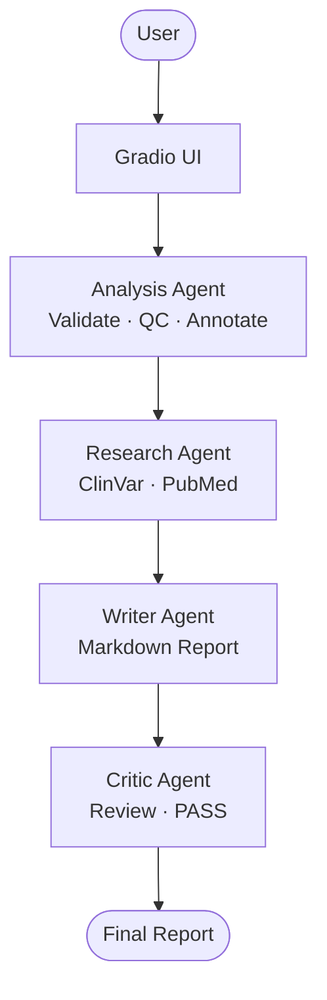
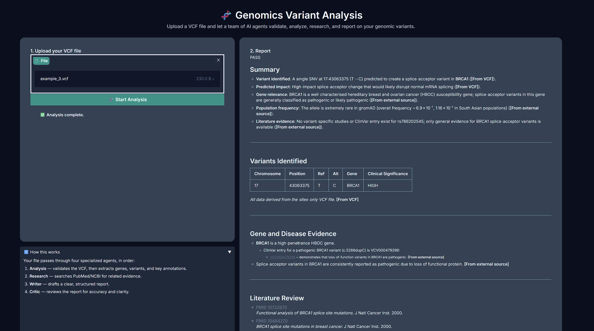
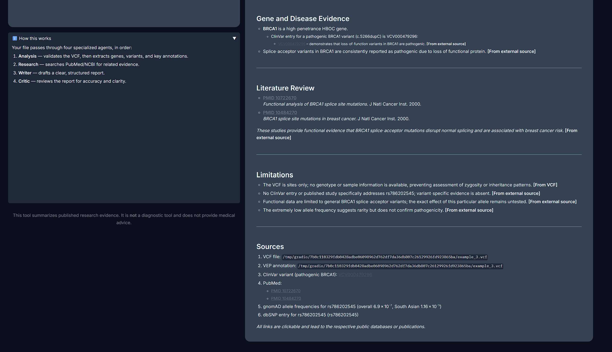

# Auto-VCF Interpretation Agent

Multi-Agent AI System for Genomic Variant Analysis

Advanced Agentic AI Systems Engineering
هندسة أنظمة الذكاء الاصطناعي الوكيلي المتقدمة

SDAIA Academy — August 2026

---

> ### Presentation
> [View the project slides](https://auto-vcf-interpretation--sqh8ndu.gamma.site/)

---


## Problem or Purpose

Genomic variant interpretation is a multi-step manual process. VCF files contain dense variant data — genes, genomic positions, and annotations — that is difficult to process by hand. Finding relevant clinical and scientific evidence across databases such as PubMed and ClinVar adds further time and effort. Reviewing and synthesizing findings from multiple sources then requires significant work and increases the risk of inconsistencies or omissions. This project automates the entire workflow through a team of specialized AI agents.

---

## Solution and Agent Design

```
User uploads VCF file
        |
        v
Analysis Agent
  validate_vcf_file  →  checks file structure, required columns, readability
  vcf_qc_stats       →  SNV/indel counts, Ti/Tv ratio, PASS rate, QUAL stats
  vep_annotate       →  Ensembl VEP REST API: gene symbol, consequence, HGVS,
                         SIFT/PolyPhen predictions, canonical transcript
        |
        v
Research Agent
  lookup_clinvar_variant  →  ClinVar: gene, clinical significance,
                              associated disease, review status, ClinVar link
  search_pubmed           →  PubMed: title, PMID, journal, date, PubMed link
        |
        v
Writer Agent
  Produces a Markdown report with six fixed sections:
    ## Summary | ## Variants Identified | ## Gene and Disease Evidence
    ## Literature Review | ## Limitations | ## Sources
  Variants table with Chromosome, Position, Ref, Alt, Gene, Significance
  Inline clickable links for ClinVar and PubMed
        |
        v
Critic Agent
  Reviews for factual consistency, unsupported claims, source relevance
  Returns PASS + full report, or NEEDS_REVISION + comments
        |
        v
Final Markdown report rendered in the Gradio UI
```

---

## How the Agent Works

The system uses CrewAI with a sequential process. Each agent receives the
output of the previous agent as context.

1. The user uploads a `.vcf` file through the Gradio interface in `app.py`.
2. The file path is injected into the analysis task at runtime.
3. The **analysis agent** runs three tools in sequence:
   - `validate_vcf_file` — checks file existence, gzip support, `##fileformat` header,
     mandatory `#CHROM` columns, and counts malformed lines.
   - `vcf_qc_stats` — computes offline QC metrics from the file: SNV/indel/MNV
     counts, transition/transversion ratio, FILTER distribution, PASS rate,
     QUAL percentiles, per-chromosome counts, and missing-genotype rate.
   - `vep_annotate` — sends variants in batches to the Ensembl VEP REST API and
     returns gene symbol, consequence terms, impact, HGVS notation, canonical
     transcript, and SIFT/PolyPhen predictions.
4. The **research agent** receives the annotated variant list and calls:
   - `lookup_clinvar_variant` — queries NCBI ClinVar by Variation ID, returns
     gene, germline classification, associated disease, and review status.
   - `search_pubmed` — queries NCBI PubMed, returns titles, PMIDs, journals,
     dates, and links.
5. The **writer agent** loads `skills/gene_disease_literature_evidence.md` at
   startup for evidence classification rules. It produces a Markdown report
   with six `##` sections and a variants table with inline clickable links.
6. The **critic agent** receives the report as context, checks it for factual
   consistency and unsupported claims, then returns PASS followed by the
   full report, or NEEDS_REVISION with specific comments.

---

## Architecture



---

## Agent Stack

| Component | Technology |
|---|---|
| Language | Python 3.13 |
| Agent Framework | CrewAI |
| LLM | OpenRouter |
| UI | Gradio |
| VCF Format | vcfpy |
| Scientific Databases | PubMed / ClinVar |
| Agent Skills | gene_disease_literature_evidence, annotation, qc |
| Runtime | uv |

---

## Project Structure

```
Auto-VCF-Interpretation-Agent/
├── README.md
├── pyproject.toml
├── .env.example
├── .gitignore
├── app.py                        # Gradio UI entry point
├── crew.py                       # CrewAI crew assembly
├── main.py                       # CLI entry point
│
├── agents/
│   ├── analysis.py
│   ├── research.py
│   ├── writer.py
│   ├── critic.py
│   └── supervisor.py
│
├── tasks/
│   ├── analysis_task.py
│   ├── research_task.py
│   ├── writer_task.py
│   ├── critic_task.py
│   └── supervisor_task.py
│
├── tools/
│   ├── __init__.py
│   ├── vcf_io.py                 # shared VCF parsing utilities
│   ├── validate_tool.py          # validate_vcf_file
│   ├── qc_tool.py                # vcf_qc_stats
│   ├── vep_tool.py               # vep_annotate
│   └── research.py               # lookup_clinvar_variant, search_pubmed
│
├── skills/
│   ├── gene_disease_literature_evidence.md
│   ├── annotation.md
│   └── qc.md
│
└── data/
    └── raw/
        ├── example.vcf
        └── expected_labels_afterannotation.tsv
```

---

## Installation

Clone the repository:

```bash
git clone https://github.com/etab12/Auto-VCF-Interpretation-Agent.git
cd Auto-VCF-Interpretation-Agent
```

Install uv:

```bash
pip install uv
```

Add CrewAI:

```bash
uv add crewai
```

Install all remaining dependencies:

```bash
uv sync
```

Copy the environment template and add your API key:

```bash
cp .env.example .env
```

---

## Configuration

Open `.env` and fill in the following:

```
OPENROUTER_API_KEY=your-openrouter-api-key
MODEL=openrouter/openai/gpt-oss-20b:free
```

| Variable | Required | Description |
|---|---|---|
| `OPENROUTER_API_KEY` | Yes | Your OpenRouter API key |
| `MODEL` | No | LLM model string. Defaults to gpt-oss-20b:free |
| `NCBI_EMAIL` | No | Email sent to NCBI per their usage policy. Recommended. |

Never commit your real `.env` file. It is excluded by `.gitignore`.

Get a free OpenRouter API key at https://openrouter.ai

---

## Usage

Run the Gradio web interface:

```bash
uv run python app.py
```

Open your browser at:

```
http://127.0.0.1:7860
```

Upload a `.vcf` file using the file picker. A sample file is included at:

```
data/raw/example.vcf
```

Click **Start Analysis**. The agents run sequentially. The final report
appears in the output panel when the critic agent returns PASS.

---

## Example Output

The system runs through a Gradio web interface where the user uploads a `.vcf` file and receives a structured Markdown report once all agents complete their pipeline stages.





---

## Limitations

- Database coverage currently limited to PubMed / ClinVar
- Designed for research and educational purposes, not clinical diagnosis.
- LLM-generated results require human review.

---

## Future Work

- **Ensembl and dbSNP**
Expanded genomic reference data.

- **Human-in-the-Loop Review**
Allow a clinical reviewer to validate or override agent findings before the final report is approved.

- **Extend Datatypes**
Support additional genomic data formats beyond plain VCF, including VCF.gz and MAF files.

- **Backend Integration**
Add a dedicated backend for data management, processing history, and multi-user support.

---

## Team

Since this is a multi-agent system, we divided the work by agent. Each team member owned one or more agents end-to-end, including the tools and tasks that go with them.

| Member | GitHub | Contribution |
|---|---|---|
| Jana Alghoraibi | [@jalghor](https://github.com/jalghor) | Analysis Agent, QC and validation tools, annotation skills |
| Etab Alotaibi | [@etab12](https://github.com/etab12) | Analysis Agent, QC and validation tools, annotation skills |
| Retaj Alshaiabn | [@RetajSWE](https://github.com/RetajSWE) | CrewAI setup, Gradio UI, Research Agent, Writer Agent |
| Sara Alsalmi | [@sara-alsalmi](https://github.com/sara-alsalmi) | Research Agent, Writer Agent |

---

## Course Information

This project was developed as part of:

Advanced Agentic AI Systems Engineering
هندسة أنظمة الذكاء الاصطناعي الوكيلي المتقدمة

SDAIA Academy — August 9-13, 2026

https://github.com/SDAIAAcademy

