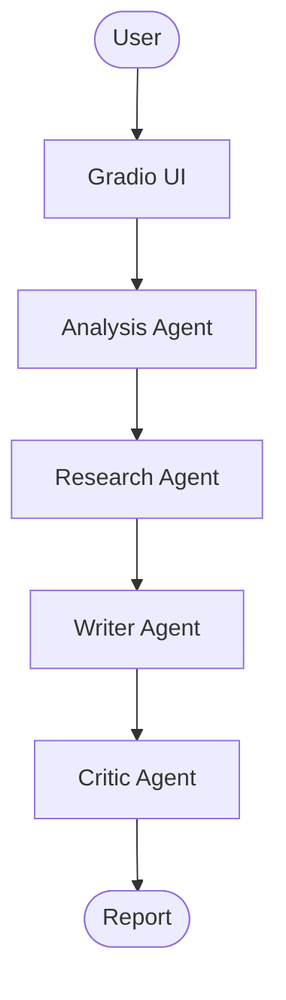

# Auto-VCF Interpretation Agent

Multi-Agent AI System for Genomic Variant Analysis

Advanced Agentic AI Systems Engineering
هندسة أنظمة الذكاء الاصطناعي الوكيلي المتقدمة

SDAIA Academy — August 2026

**Presentation:** [View Slides](https://auto-vcf-interpretation--sqh8ndu.gamma.site/)


## Problem or Purpose


VCF files contain dense variant information — genes, genomic positions, and
annotations — making the data difficult to process manually.

Finding relevant scientific and clinical evidence across databases such as
PubMed and ClinVar is a manual, time-consuming process.

Reviewing and synthesizing findings from multiple sources requires significant
effort and increases the risk of inconsistencies or omissions.

This project addresses all three. The Auto-VCF Interpretation Agent automates
genomic variant interpretation through a multi-agent pipeline. A VCF file
enters the system and each agent handles a distinct stage: parsing and
validation, scientific evidence retrieval, structured report generation, and
report review — without the user querying any external source manually.

---

## Solution and Agent Design

```
User uploads VCF file
        |
        v
Analysis Agent
  Validates the VCF file structure
  Extracts variants: chromosome, position, ref allele, alt allele, gene
        |
        v
Research Agent
  Calls Lookup ClinVar Variant for each variant ID
    Returns: gene, clinical significance, associated disease, review status
  Calls Search PubMed for each relevant gene or variant
    Returns: paper title, PMID, journal, publication date, PubMed URL
        |
        v
Writer Agent
  Combines analysis and research outputs
  Produces a structured plain text report with six fixed sections
  Labels each fact as [From VCF] or [From external source]
  Includes full ClinVar and PubMed URLs inline
        |
        v
Critic Agent
  Reviews the report for accuracy, consistency, and unsupported claims
  Returns PASS or NEEDS_REVISION with reviewer comments
        |
        v
Final report returned to the Gradio UI
```

---

## How the Agent Works

The system uses CrewAI with a sequential process. Each agent hands its output
to the next as context.

1. The user uploads a `.vcf` file through the Gradio interface in `app.py`.
2. The file path is injected into the analysis task description at runtime.
3. The analysis agent reads the VCF using `vcfpy` and extracts variant records,
   including the `SOURCE_ID` field which contains ClinVar Variation IDs.
4. The research agent receives the variant list and calls:
   - `lookup_clinvar_variant` — NCBI ClinVar esummary API, returns gene,
     germline classification, associated disease, and review status.
   - `search_pubmed` — NCBI E-utilities esearch and esummary, returns
     paper titles, PMIDs, journals, dates, and PubMed links.
5. The writer agent loads `skills/gene_disease_literature_evidence.md` at
   startup. This skill file provides evidence classification guidelines,
   conflict handling instructions, and evidence strength evaluation rules.
6. The writer produces a report using six fixed sections in a fixed order.
7. The critic agent checks the report and passes or requests revisions.

---

## Architecture



---

## Agent Stack

| Component | Technology |
|---|---|
| Language | Python 3.13 |
| LLM | OpenRouter (configurable, defaults to gpt-oss-20b:free) |
| Agent Framework | CrewAI |
| UI | Gradio |
| VCF Parsing | vcfpy |
| External APIs | NCBI E-utilities — ClinVar and PubMed (free, no key required) |
| Agent Skills | skills/gene_disease_literature_evidence.md, annotation.md, qc.md |
| VCF Tools | tools/vcf_tools.py — validate_vcf, parse_vcf |
| Research Tools | tools/research.py — lookup_clinvar_variant, search_pubmed |
| Runtime | uv |

OpenRouter was selected because it provides a single unified API endpoint for
multiple LLM providers, including free-tier models, which allows the project to
run without a paid API subscription.

NCBI E-utilities was selected because it is the authoritative free API for
ClinVar and PubMed, the two primary sources for clinical variant evidence and
genomics literature.

---

## Project Structure

```
Auto-VCF-Interpretation-Agent/
├── README.md
├── pyproject.toml
├── .env.example
├── .gitignore
├── app.py                        # Gradio UI entry point
├── crew.py                       # CrewAI crew assembly
├── main.py                       # CLI entry point
│
├── agents/
│   ├── analysis.py
│   ├── research.py
│   ├── writer.py
│   ├── critic.py
│   └── supervisor.py
│
├── tasks/
│   ├── analysis_task.py
│   ├── research_task.py
│   ├── writer_task.py
│   ├── critic_task.py
│   └── supervisor_task.py
│
├── tools/
│   ├── __init__.py
│   ├── vcf_tools.py              # validate_vcf, parse_vcf
│   └── research.py               # lookup_clinvar_variant, search_pubmed
│
├── skills/
│   ├── gene_disease_literature_evidence.md
│   ├── annotation.md
│   └── qc.md
│
└── data/
    └── raw/
        ├── example.vcf
        └── expected_labels_afterannotation.tsv
```

---

## Installation

Clone the repository:

```bash
git clone https://github.com/etab12/Auto-VCF-Interpretation-Agent.git
cd Auto-VCF-Interpretation-Agent
```

Install dependencies using uv:

```bash
uv sync
```

Copy the environment template:

```bash
cp .env.example .env
```

---

## Configuration

Open `.env` and fill in the following:

```
OPENROUTER_API_KEY=your-openrouter-api-key
MODEL=openrouter/openai/gpt-oss-20b:free
```

| Variable | Required | Description |
|---|---|---|
| `OPENROUTER_API_KEY` | Yes | Your OpenRouter API key |
| `MODEL` | No | LLM model string. Defaults to gpt-oss-20b:free |
| `NCBI_EMAIL` | No | Email sent to NCBI per their usage policy. Recommended. |

Never commit your real `.env` file. It is excluded by `.gitignore`.

Get a free OpenRouter API key at https://openrouter.ai

---

## Usage

Run the Gradio web interface:

```bash
uv run python app.py
```

Open your browser at:

```
http://127.0.0.1:7860
```

Upload a `.vcf` file using the file picker. A sample file is included at:

```
data/raw/example.vcf
```

Click **Start Analysis**. The agents run sequentially. The final report
appears in the output panel when the critic agent returns PASS.

---

## Example Output

Screenshots of the Gradio interface and sample report output will be added here.

---

## Limitations

- Database coverage currently limited to PubMed / ClinVar
- Designed for research and educational purposes, not clinical diagnosis.
- LLM-generated results require human review.

---

## Future Work

**Ensembl and dbSNP**
Expanded genomic reference data.

**Human-in-the-Loop Review**
Allow a clinical reviewer to validate or override agent findings before the final report is approved.

**Extend Datatypes**
Support additional genomic data formats beyond plain VCF, including VCF.gz and MAF files.

**Backend Integration**
Add a dedicated backend for data management, processing history, and multi-user support.

---

## Team

| Member | GitHub | Contribution |
|---|---|---|
| Jana Alghoraibi | [@RetajSWE](https://github.com/RetajSWE) | |
| Etab Alotaibi | [@etab12](https://github.com/etab12) | |
| Retaj Alshaiabn | [@RetajSWE](https://github.com/RetajSWE) | |
| Sara Alsalmi | [@sara-alsalmi](https://github.com/sara-alsalmi) | |
---

## Course Information

This project was developed as part of:

Advanced Agentic AI Systems Engineering
هندسة أنظمة الذكاء الاصطناعي الوكيلي المتقدمة

SDAIA Academy — August 9-13, 2026

https://github.com/SDAIAAcademy

